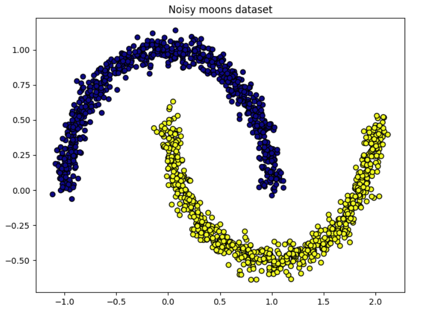

# Machine Learning Classifier Comparison

This project evaluates dozens of combinations of classifiers, evaluation methods, and normalization techniques to determine which combinations perform best on different datasets.

## Datasets analyzed

Five datasets from sklearn:
- **Noisy circles**
- **Noisy moons**
- **Blobs**
- **Anisotropically distributed data**
- **Varied data**

## Programming language and modules used

- Python 3.11
- Scikit-learn
- Numpy
- Matplotlib (for plots)

## Methods compared

**Classifiers**:
- Naive bayes
- Decision tree
- Support vector machine (SVM)
- K-nearest neighbors (KNN) (k=3, 5, 7)
- Artificial neural networks (ANN)

**Evaluation methods**:
- Holdout (train/test split)
- Random subsampling
- Leave-one-out cross-validation
- K-fold cross-validation

**Normalization techniques**:
- Min-max normalization
- Z-score normalization  
- Unnormalized

## Key results

| Dataset | Best classifier | Best evaluation | Best normalization | Accuracy |
|---------|----------------|-----------------|-------------------|----------|
| Noisy circles | SVM | Random subsampling | Unnormalized | 97.5% |
| Noisy moons | KNN | Holdout | Z-score | 100% |
| Blobs | KNN (k=3 specifically) | Holdout | Min-max | 100% |
| Anisotropic | Naive bayes | Leave-one-out | Min-max | 100% |
| Varied | ANN | K-fold | Z-score | 96.7% |

## Key findings

### Normalization significance
- Normalization's level of impact was dependent on the classifier and evaluation method
- Normalization's impact on accuracy was typically less than 0.1
- However, **min-max normalization** did notably lower accuracy when using ANNs

### Classifier performance
- **Decision tree** consistently resulted in lower accuracy
- **KNN** was best with clustered and moon-shaped data
- **SVM** was best with data with complex boundaries (e.g. noisy circles)
- **ANN** was best with varied and complex data, but it had the longest runtime

### Datasets' variability in accuracy
- **Linearly separable data** (e.g. anisotropic) proved simpler to analyze, many combinations achieved 100% accuracy
- **Complex patterns** (e.g. varied data) proved more difficult to analyze, consistently had a lower average accuracy
- **Dataset parameters** (e.g. cluster_std) had to be adjusted to result in high, but not perfect, accuracy, so that a best combination could be determined

## Dataset plots





## Installation
```bash
# Clone repository
git clone https://github.com/kendomi0/ml-classifier-comparison.git
cd ml-classifier-comparison

# Install dependencies
pip install -r requirements.txt
```

### Usage
Run each individual evaluation method tested with all datasets and classifiers (will prompt for dataset selection):
```bash
python evaluation_methods/holdout_all.py
python evaluation_methods/randomsub_all.py
python evaluation_methods/loo_all.py
python evaluation_methods/kfold_all.py
```
Run best combinations for each dataset:
```bash
python best_combinations/noisy_circles_best.py
python best_combinations/noisy_moons_best.py
python best_combinations/blobs_best.py
python best_combinations/anisotropic_best.py
python best_combinations/varied_best.py
```
